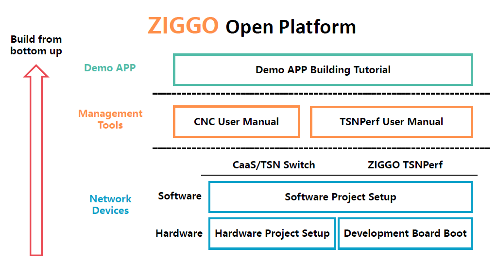
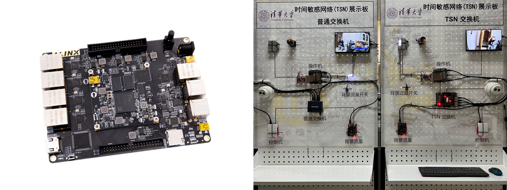
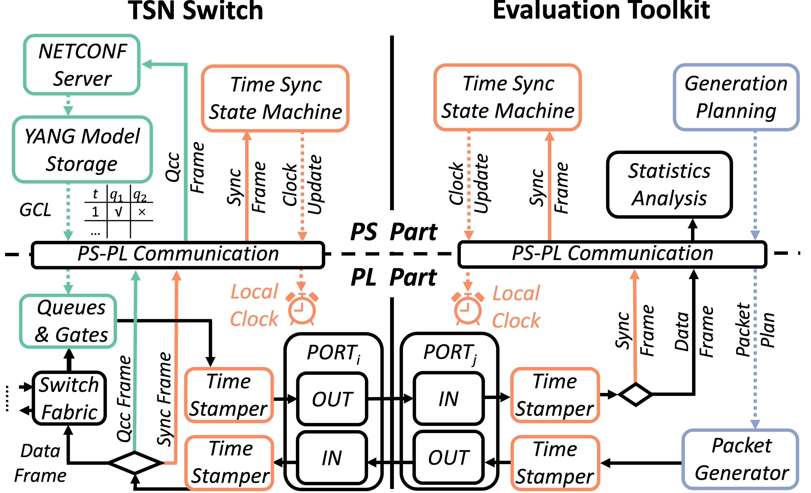

<div align="center">

# ZIGGO Device: A flexible and standard-compliant toolkit for TSN performance evaluation.

</div>

<h3 align="center">
    <a href="http://tns.thss.tsinghua.edu.cn/ziggo/">Project Page</a> |
    <a href="https://ieeexplore.ieee.org/document/10228980">Paper</a> |
    <a href="https://github.com/Mobisense/Ziggo-CaaS-Switch">ZIGGO-CaaS-Switch</a> |
    <a href="https://github.com/MobiSense/Ziggo-Device">ZIGGO-Device</a> 
</h3>


## Table of Contents

- [ZIGGO Device: A flexible and standard-compliant toolkit for TSN performance evaluation.](#ziggo-device-a-flexible-and-standard-compliant-toolkit-for-tsn-performance-evaluation)
  - [Table of Contents](#table-of-contents)
  - [Introduction](#introduction)
  - [ZIGGO Open Platform](#ziggo-open-platform)
  - [Demo](#demo)
  - [Features](#features)
  - [Read before start](#read-before-start)
  - [Getting Started](#getting-started)
  - [System Design](#system-design)
  - [Demo APP Tutorial](#demo-app-tutorial)
  - [License and Citation](#license-and-citation)
  - [TODO List](#todo-list)
  - [Contributing](#contributing)

## Introduction

ZIGGO is a `flexible`, `standard-compliant`, and `control-function-virtualized` TSN switch platform ready for **industrial control**, **automotive electronics**, and other **time-sensitive applications**.

This is the document for the ZIGGO Device. (We also offer [ZIGGO-CaaS-Switch](https://github.com/Horacehxw/Ziggo-CaaS-Switch) that comply with the IEEE 802.1 TSN standard.) Our Device supports testing all standards-compliant switches.

## ZIGGO Open Platform



The construction of the ZIGGO Open Platform consists of three levels: network device, management tools, and a Demo App:

- The software and hardware projects, along with the development board startup [tutorial](docs/getting-started.md), provide instructions for setting up an individual network device.

- The [CNC User Manual](docs/cnc-manual.md) and [Device User Manual](docs/Device.md) cover system configuration and management tools.

- Lastly, we offer a comprehensive [Demo App building tutorial](docs/testbed.md) that instructs how to
  collaboratively build a complete and functional Demo using network devices and
  management tools.

## Demo

We provide a demonstration video of the TSN switch. It demonstrates the superior performance of the `ZIGGO-CaaS-Switch` compared to the normal switch.

The left side of the picture is the ZYNQ development board we use, and the right side is the TSN display board we built.

[](https://cloud.tsinghua.edu.cn/f/b307da6840d84e5f9ff1/)

> Click the pic to watch the video! Or just click [here](https://cloud.tsinghua.edu.cn/f/b307da6840d84e5f9ff1/).

## Features

* ZIGGO supports the simultaneous transmission of both `Information Technology (IT)` and `Operation Technology (OT)` data traffic with QoS guarantee.

* ZIGGO complies with IEEE standards `802.1AS`, `Qav`, `Qbv`, and `Qcc`.

* ZIGGO provides `Real-time` and `Deterministic` Ethernet transport
  
  * ZIGGO achieve **Zero Packet Loss** , **Microsecond-level Latency** with **Nanosecond-level Jitter Gate Ability**.
  * ZIGGO guarantee **Gigabit Throughput**.
  * ZIGGO provide gate accuracy applicable to **All Ethernet Frame Sizes**.

## Read before start

Getting started with ZIGGO-CaaS-Switch/ZIGGO-Device is a ***pretty hard*** task. Users/developers need to have sufficient basic knowledge and be prepare to for a long periond of learning and debugging.

Please refer to [basic_knowledge.md](docs/basic_knowledge.md) to check if you have ability to use ZIGGO competently. 

## Getting Started

Please refer to [required.md](docs/required.md)  to  get prepared.

After that, please refer to [getting_started.md](docs/getting-started.md) for the build and run a single ZIGGO Device.

## System Design

ZIGGO is implemented on ZYNQ-7000 SoC and exploits ZYNQ's both hardware and software programmability. 



We also provide more in-depth [documentation](docs/system-design.md) explaining specific design principles for ZIGGO Device.

## Demo APP Tutorial

We also provide a [testbed build document](docs/testbed.md) that allows you to build a real-time Ethernet system using the ZIGGO swtich and Device. 

Through this platform, we can measure the `delay` and `jitter` of TSN time-critcial traffic, the switch's `gating capability`, `bandwidth guarantee` and `gating accuracy`. 

Replacing ZIGGO CaaS switches with commercial TSN switches can also test its above capabilities.

## License and Citation

ZIGGO is released under a [MIT license](LICENSE.txt). 

Please consider citing our papers if the project helps your research with the following BibTex:

```bibtex
@inproceedings{caas,
  author={Yang, Zheng and Zhao, Yi and Dang, Fan and He, Xiaowu and Wu, Jiahang and Cao, Hao and Wang, Zeyu and Liu, Yunhao},
  booktitle={IEEE INFOCOM 2023 - IEEE Conference on Computer Communications}, 
  title={CaaS: Enabling Control-as-a-Service for Time-Sensitive Networking}, 
  year={2023},
  pages={1-10},
  doi={10.1109/INFOCOM53939.2023.10228980}}
```

```bibtex
@inproceedings{etsn,
  author={Zhao, Yi and Yang, Zheng and He, Xiaowu and Wu, Jiahang and Cao, Hao and Dong, Liang and Dang, Fan and Liu, Yunhao},
  booktitle={IEEE ICDCS 2022 - IEEE International Conference on Distributed Computing Systems}, 
  title={E-TSN: Enabling Event-triggered Critical Traffic in Time-Sensitive Networking for Industrial Applications}, 
  year={2022},
  volume={},
  number={},
  pages={691-701},
  doi={10.1109/ICDCS54860.2022.00072}}
```

## TODO List

- [x] ZIGGO CaaS Switch Release
- [x] ZIGGO Device Release
- [x] ZIGGO Device Source Code
- [x] Tutorial for build a testbed
- [ ] Test Case for TSN

> We will expand each test in the tutorial to multiple test cases to cover different edge cases and comprehensively test the performance of TSN switches.

- [ ] Support Device List

> At present, we have only tested our own Ziggo switches and are testing other commercial switches (such as Huawei ,H3C and NXP). We expect to maintain a list of test results in the future.

## Contributing

Please see the [guide](docs/contributing.md) for information on how to ask for help or contribute to the development of ZIGGO!

> The development team will only answer questions on github issues and reject other forms of questions.