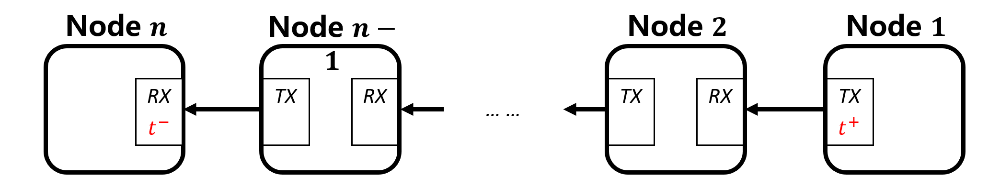
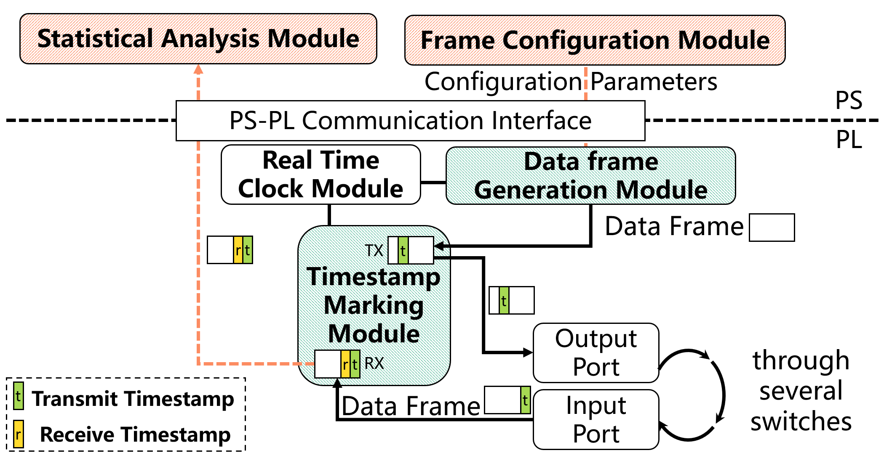

# Design Overview

ZIGGO is implemented on ZYNQ-7000 SoC and exploits ZYNQ's both hardware and software programmability. 


## Table of Content

- [Evaluation Method](#evaluation-method)
- [Test data frame data structure](#test-data-frame-data-structure)
- [Module Design](#module-design)
  - [Correspondence between software and hardware registers](#correspondence-between-software-and-hardware-registers)
  - [Offline Analysis and Design](#offline-analysis-and-design)

## Evaluation Method

The ZIGGO Evaluation Toolkit is used to send and receive test data frames for the purpose of ensuring `accurate delay calculations`. 

To achieve this accuracy, the toolkit needs to **synchronize its time** with the TSN switch and record a **global hardware timestamp** in the test data frames. 

As shown in the diagram below, in a data flow link with $n$ network nodes, Node $1$ serves as the source node to send test data frames, Node $n$ acts as the destination node to receive test data frames, and all the intermediate nodes (Node $2$ to Node $n-1$) are TSN switches. 

When a test data frame is sent from the source node, the hardware records the timestamp $t^+$ of when the frame was sent in the data frame. Finally, when the data frame arrives at the destination node, the destination node records the timestamp $t^-$ of when the frame entered that node. By calculating $(t^−−t^+)$, we can determine the end-to-end latency of the data frame.



> In this doc, $t^{dir}$ is used to represent the timestamp of data frames entering and leaving the hardware. Here, "dir" represents the direction of data frames entering or leaving the nodes, with " + " indicating data frames leaving the node and " − " indicating data frames entering the node. 

## Test data frame data structure

In order to analyze the end-to-end latency of each data frame on complex network topologies, we have established specific guidelines for the content of data segments in the Ethernet frame structure. The structure of time-sensitive networking test data frames is as shown in the following table.

| ield                    | Byte Length | Description                                                                                                    |
| ----------------------- | ----------- | -------------------------------------------------------------------------------------------------------------- |
| Destination Address     | 6           | Destination node MAC address                                                                                   |
| Source Address          | 6           | Source node MAC address                                                                                        |
| VLAN Tag                | 4           | Divided into four fields: VLAN Data Frame Type (0x8100), Priority, Canonical Format Indicator, and VLAN Number |
| Data Frame Type         | 2           | Used to identify test data frames, set to 0x66ab                                                               |
| Reserved Bits           | 2           |                                                                                                                |
| `$t^+$ (TX Timestamp)`  | 8           | Timestamp when transmitted from the source node                                                                |
| `$t^-$ (RX Timestamp)`  | 8           | Timestamp when received by the destination node                                                                |
| Data Stream ID (SEQ_ID) | 2           | Unique identifier for each data stream                                                                         |
| Data Frame ID (PKT_ID)  | 4           | Sequence number of data frames within each data stream, starting from 0                                        |

## Module Design

The overall module design for ZIGGO Evaluation Toolkit is depicted in the following diagram. The Time Synchronization module used by the Toolkit shares a design that is nearly identical to the Switch, and the diagram does not provide extensive details on the time synchronization-related modules.

The configuration module in the PS section (`software/pkt_gen_main.cpp`) communicates with the Data Frame Generation module by using the UIO driver and AXI4-Lite interface to send the transmission rules for the test data frames to relevant registers in the Data Frame Generation module (specifically, `hardware/IP_repo/pkt_gen_controller_v1.1/pkt_gen_controller_1.1/hdl/pkt_gen_controller_v1_1.v` is responsible for configuration, and `hardwire/HDL/axi_packet_generator.v` is responsible for generating and transmitting the data frames) using the global synchronized time as a reference for timing.

The Timestamp Marking module (`hardwire/HDL/hw_timestamp/tsu/tsu_axis_tx.v` and     `hardwire/HDL/hw_timestamp/tsu/tsu_axis_rx.v`) is located at the send and receive ports of the Ziggo-Evaluation-Toolkit. It is used to record the hardware timestamps of sent and received data frames within the test data frames.

The received data frames are ultimately uploaded to the PS section via a DMA channel (in our design, we currently use a time-synchronized DMA channel for transmitting test data frames) for statistical analysis (handled in the `process_critical_frame` function in `software/pkt_gen_control/pkt_gen.c`).



The maximum frame transmission period (superperiod parameter in `pkt_gen_main.cpp`) refers to the upper limit on the periodicity for sending data streams from the toolkit. Within this maximum frame transmission period, the Data Frame Generation module allocates a maximum of 32 time slots for all data streams. Each time slot is used to send all the data frames for the corresponding data stream at the specified transmission time.

As illustrated in the diagram, the evaluation toolkit sends two types of data streams: Stream 𝐹1 with a transmission period of 2𝑇 and Stream 𝐹2 with a transmission period of 4𝑇. The maximum frame transmission period for the evaluation toolkit is 6𝑇. In this scenario, the Data Frame Generation module sets up 5 time slots within the maximum frame transmission period and sends test data frames in sequential order according to the specified time slots.


Users can configure the Ziggo-Evaluation-Toolkit to generate multiple data streams, and the configuration parameters for each data stream are as follows, with clear explanations provided in the comments of the `pkt_gen.h` header file:

```C++
// pkt_gen_app\pkt_gen_control\pkt_gen.h

/**
 * @brief Set the pkt gen slot object
 * 
 * @param slot_id 0~31, indicate a slot in pkt_gen IP core
 *      IMPORTANT: tx_offset for each slot id should be monotonic increasing
 * @param seq_id sequence ID that uniquely identify a stream
 *              To further utilize this field, it may be {job_id: 8bit, flow_id: 8bit}
 * @param pkt_number number of packets in one sent, should be 1
 * @param pkt_id_start start of pkt_id
 * @param pkt_id_update update of next pkt_id
 * @param tx_offset transmission time inside a period, in ns
 * @param src_mac 6Byte array
 * @param dest_mac 6Byte array
 * @return int 
 */
int set_pkt_gen_slot (int slot_id, uint16_t seq_id, uint16_t pkt_number, uint32_t pkt_id_start, 
        uint32_t pkt_id_update, int64_t tx_offset, uint8_t *src_mac, uint8_t *dest_mac);
```

The Timestamp Marking Module will write the timestamp of the current synchronized clock into the outgoing data frame just before it is transmitted by the MAC controller of the toolkit. When the MAC controller in the PL (Programmable Logic) receives the first bit of data in the frame from the physical link, the Timestamp Marking Module records the timestamp of the current synchronized clock. It subsequently writes this timestamp into the data frame during the packet reception process and hands it over to the statistical analysis module in the PS (Processing System) section for further analysis and processing.

### Correspondence between software and hardware registers

The correspondence in terms of time synchronization is the same as in the Ziggo TSN Switch. 

In this section, we will primarily focus on the correspondence related to data frame transmission configuration. The software registers' addresses can be found in `software/pkt_gen_control/pkt_gen.c`.

```C++
// define global register address
#define GLOBAL_PERIOD_NS    0x00000000
#define GLOBAL_OFFSET_NS    0x00000008
#define SEQ_VALID           0x00000010
#define SEQ_ENABLE_VLAN     0x00000014
#define WRITE_LOCK          0x00000018

// define write lock value
#define NOT_WRITING     0x00000001
#define WRITING         0x00000000

// define address pointer for sequences
#define SEQ_CONTENT     0x0000001c
```

The hardware registers are located in `tsn_device\IP_repo\pkt_gen_controller_v1.1\pkt_gen_controller_1.1\hdl\pkt_gen_controller_v1_1_S00_AXI.v`.

```c++
if (slv_reg_wren)
      begin
        case ( axi_awaddr[ADDR_LSB+OPT_MEM_ADDR_BITS:ADDR_LSB] )
          9'h000:
            for ( byte_index = 0; byte_index <= (C_S_AXI_DATA_WIDTH/8)-1; byte_index = byte_index+1 )
              if ( S_AXI_WSTRB[byte_index] == 1 ) begin
                // Respective byte enables are asserted as per write strobes 
                // Slave register 0
                slv_reg0[(byte_index*8) +: 8] <= S_AXI_WDATA[(byte_index*8) +: 8];
              end  
          9'h001:
            for ( byte_index = 0; byte_index <= (C_S_AXI_DATA_WIDTH/8)-1; byte_index = byte_index+1 )
              if ( S_AXI_WSTRB[byte_index] == 1 ) begin
                // Respective byte enables are asserted as per write strobes 
                // Slave register 1
                slv_reg1[(byte_index*8) +: 8] <= S_AXI_WDATA[(byte_index*8) +: 8];
              end  
          9'h002:
            for ( byte_index = 0; byte_index <= (C_S_AXI_DATA_WIDTH/8)-1; byte_index = byte_index+1 )
              if ( S_AXI_WSTRB[byte_index] == 1 ) begin
                // Respective byte enables are asserted as per write strobes 
                // Slave register 2
                slv_reg2[(byte_index*8) +: 8] <= S_AXI_WDATA[(byte_index*8) +: 8];
              end  
...
```

In this context, the hardware registers with names starting with "slv_reg" are each 32 bits wide, and their addresses are spaced by 4 bytes. So, for example, if the software-level address is $0x00000018$, you need to divide this address by 4, which results in $ 24/4 = 6$. Therefore, this address corresponds to the hardware register "`slv_reg6`" in the hardware module. This helps establish the correspondence between software and hardware registers.

### Offline Analysis and Design

In the `offline_analyze` branch of the Toolkit, we perform packet capture and analysis by forwarding packets from the Toolkit to a powerful desktop computer after the timestamps the incoming packets. This method ensures that even at gigabit speeds, no packets are dropped, and there are relatively minor hardware changes.

One aspect of the modification is that timestamps are not added to the data frames when they are transmitted from the toolkit. This can be seen in the `HDL/trimode_mac/simple_mac_no_shared.v` file where the "tsu_axis_tx" section is commented out.

Another aspect is the modification of the "frame_type" to change the direction of data frames. Previously, both PTP frames and test data frames were uploaded to the PS section via time-synchronized DMA, with IT traffic uploaded to PS_ETH. This split the traffic into two directions ("axis_switch_1_2"). Now, it has been split into three directions ("axis_switch_1_3"). For offline analysis, only PTP frames need to be transferred to the PS, while test data frames need to be separated and sent out from ETH2. This requires a finer-grained separation of traffic.

```c++
 // separate IT frames, ptp frames and critical frames
axis_switch_1_3 axis_switch_1_3_inst (
    .aclk(rx_fifo_clock),                    // input wire aclk
    .aresetn(rx_fifo_resetn),              // input wire aresetn
    .s_axis_tvalid(rx_axis_fifo_tvalid_8),  // input wire [0 : 0] s_axis_tvalid
    .s_axis_tready(rx_axis_fifo_tready_8),  // output wire [0 : 0] s_axis_tready
    .s_axis_tdata(rx_axis_fifo_tdata_8),    // input wire [7 : 0] s_axis_tdata
    .s_axis_tlast(rx_axis_fifo_tlast_8),    // input wire [0 : 0] s_axis_tlast
    .s_axis_tdest(frame_type),    // input wire [1 : 0] s_axis_tdest
    .m_axis_tvalid({rx_axis_it_fifo_tvalid, rx_axis_ptp_fifo_tvalid, tx_axis_fifo_legacy_tvalid[1]}),  // output wire [2 : 0] m_axis_tvalid
    .m_axis_tready({rx_axis_it_fifo_tready, rx_axis_ptp_fifo_tready, tx_axis_fifo_legacy_tready[1]}),  // input wire [2 : 0] m_axis_tready
    .m_axis_tdata({rx_axis_it_fifo_tdata, rx_axis_ptp_fifo_tdata, tx_axis_fifo_legacy_tdata[1]}),    // output wire [23 : 0] m_axis_tdata
    .m_axis_tlast({rx_axis_it_fifo_tlast, rx_axis_ptp_fifo_tlast, tx_axis_fifo_legacy_tlast[1]}),    // output wire [2 : 0] m_axis_tlast
    .m_axis_tdest(),    // output wire [5 : 0] m_axis_tdest
    .s_decode_err()    // output wire [0 : 0] s_decode_err
);
```

The `tx_axis_fifo_legacy_tdata[1]` indicates sending from ETH2.
