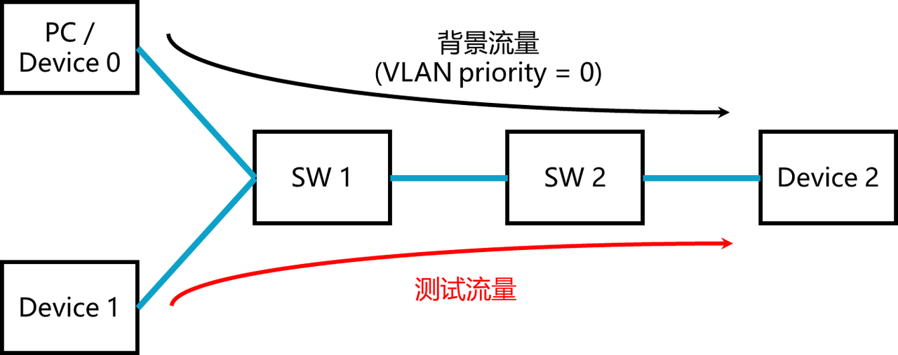
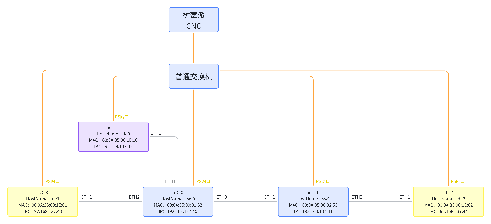

# 互联互通测试TestBed搭建流程

## 目录

- [TestBed简单介绍](#testbed简单介绍)
- [互联互通测试项目介绍](#互联互通测试项目介绍)
  - [1. 基准测试](#1-基准测试)
  - [2. 门控能力](#2-门控能力)
  - [3. 带宽保证](#3-带宽保证)
  - [4. 门控精度](#4-门控精度)
- [设备参数设置与部署](#设备参数设置与部署)
- [TestBed运行流程](#testbed运行流程)
  - [准备工作](#准备工作)
    - [控制脚本准备](#控制脚本准备)
    - [背景流量发送](#背景流量发送)
  - [基准测试](#基准测试)
  - [门控能力](#门控能力)
  - [带宽保证](#带宽保证)
  - [门控精度](#门控精度)

## TestBed简单介绍

我们内部对自己研发的CaaS-Switch进行了互联互通测试，采用的网络拓扑如下所示。


本Demo需要4个FPGA开发板（2个Device、2个CaaS-Switch）和1台普通PC。如果条件有限可以删去一个CaaS-Switch。PC负责发送背景流量，路径为黑色箭头；左侧Device负责发送测试流量（关键流量），路径为红色箭头。

所有测试项目的流程大致可以分为两个阶段：

1. 时间同步：启动时间同步，保证Device、CaaS-Switch在一个时钟域下。

   注：时间同步程序运行在Device、CaaS-Switch的系统中。

2. 发送测试流量：根据schedule.json文件，Device进行测试流量发送。

## 互联互通测试项目介绍

### 1. 基准测试

- 目的：测试无背景流量情况下，高优先级流量的两跳端到端延迟、丢包率、抖动，作为比较基准。
- 预期：延迟符合规划，抖动较低（100ns左右）。

### 2. 门控能力

- 目的：测试通用情况下流量调度效果，和两个交换机的门控对接能力。
- 方案：
  背景流量（VLAN priority = 0）打到线速，每个调度周期预留长度为 3 的时隙给高优先级流量，
  1. 每个周期定时发送 4 个数据包长度为 1500Byte 的高优先级（VLAN priority = 1）测试流量，记录端到端平均延迟、抖动、丢包率、到达顺序
  2. 每个周期定时发送 8 个数据包长度为 1500Byte 的高优先级（VLAN priority = 1）测试流量，记录是否每个周期通过且仅 n 个包
- 预期：
  1. 延迟、抖动、丢包率和基准一致
  2. 每个周期定时发送 4 个数据包时，丢包率为0
  3. 每个周期定时发送 8 个数据包时，每个周期通过且仅通过 5 个包（每8个包丢3个，因为每个时隙里恰好可以把第五个包发出去，余下三个包丢掉），丢包率为37.5%

### 3. 带宽保证

- 目的：测试交换机能够进行带宽预留，且两个交换机优先级映射、运行 cycle 和 offset 基本一致。
- 方案：
  背景流量（VLAN priority = 0）打到线速（1Gbps），配置交换机预留 50% 时隙给高优先级流量（VLAN priority = 1），其余 50% 只允许低优先级流量，
  1. 测试流量高优先级（VLAN priority = 1）情况下打到线速（经测试，每个周期[33ms]连续发送2752个1500B的包，基本达到1000Mbps），记录端到端平均延迟、抖动、丢包率、到达顺序
  2. 测试流量高优先级（VLAN priority = 1）情况下打到50%线速（每个周期[33ms]连续发送1376个1500B的包），记录端到端平均延迟、抖动、丢包率、到达顺序
- 预期：
  1. 高优先级测试流量100%线速：延迟、抖动和基准一致，丢包率 50% 左右
  2. 高优先级测试流量50%线速：延迟、抖动和基准一致，0丢包率

### 4. 门控精度

- 目的：测试门控时隙长度的设置精度
- 方案：(n=1,2,4,8,...)
  1. 每个调度周期预留长度为 1 的时隙给高优先级流量
  2. 每个周期发送 n 个数据包长度为1/n*1500Byte的高优先级（VLAN priority = 1）测试流量，记录是否每个周期通过 n 个包
     1. n=1, 
- 预期：
  1. n=1,2,4,8 情况下都能每个周期通过且仅通过 n 个包

> 如果您按照下文的配置使用我们开源的ZIGGO交换机和Device，则您可以在上面四个测试中得到和预期相类似的效果。如果出现了任何问题，欢迎在github上提出issue。

## 设备参数设置与部署

Switch软硬件代码在仓库 [ZIGGO-Caas-Switch](https://github.com/Horacehxw/Ziggo-CaaS-Switch) 中，使用主分支即可。

Device的软硬件代码在本仓库。

> 注意：带宽能力测试中的Device需要使用offline_analyze分支，门控精度测试中的Device需要使用packet_resize分支【用于自定义测试包大小】。测试中请勿忘记切换分支。

所有设备的IP、MAC和ID如下所示，与本文档后面提供的JSON配置文件对应：



对应的config文件可见`config.json`

## TestBed运行流程

### 准备工作

#### 控制脚本准备

可以参考 [CNC-User-Manual.md](cnc-manual.md)

#### 背景流量发送

可以直接在Linux PC中运行`send.py`脚本。（需要安装scapy,tcpreplay）

### 基准测试

Switch、Device 的软硬件都使用主分支。

测试步骤：

1. 修改batch.mjs修改正确的配置文件名
2. ./batch.mjs pull（注意分支正确）
3. ./batch.mjs distribute
   Device每次发送4个数据包，每个Switch都预留了3个时隙，将以下两个配置文件下发即可：
   `base/d3s2-baseline-3t-config.json`，
   `base/d3s2-baseline-3t-schedule-base.json`
4. ./batch.mjs launch （包括了时间同步和数据包发送）
5. ./batch.mjs collect

### 门控能力

Switch、Device 的软硬件都使用主分支。

1. 让背景流量Device发包（基准测试不需要发送背景流量）
2. 修改batch.mjs修改正确的配置文件名
3. ./batch.mjs pull（注意分支正确）
4. ./batch.mjs distribute
   Device1每次发送4个数据包，每个Switch都预留了3个时隙，将以下两个配置文件下发即可：
   `gate/d3s2-baseline-3t-config.json`，
   `gate/d3s2-baseline-3t-schedule-gate.json`
5. ./batch.mjs launch
6. ./batch.mjs collect
7. 将上述的schedule.json中的Device发包个数从4改为8，再从上述步骤4重新测试，修改后的schedule.json如下所示

```json
{
    "type": "link",
    "from": 3,
    "to": 0,
    "from_port": 0,
    "id": 7,
    "schedule": [
        {
            "period": 2048,
            "start": 0,
            "end": 8,
            "job_id": 1,
            "flow_id": 1
        }
    ]
},
```

### 带宽保证

Switch代码使用主分支，Device代码使用offline_analyze分支。

测试步骤：

1. 让背景流量Device发包（基准测试不需要发送背景流量）

2. 修改batch.mjs修改正确的配置文件名

3. ./batch.mjs pull（注意分支正确）

4. ./batch.mjs distribute
   Device1每次发送1376个数据包，每个Switch都预留了1024个时隙，将以下两个配置文件下发即可：
   `bandwidth/d3s2-baseline-50%t-config.json`，
   `bandwidth/d3s2-baseline-50%t-schedule.json`

5. ./batch.mjs launch

6. 使用离线分析

7. 将上述的schedule.json中的Device发包个数从1376改为2752，再从上述步骤4重新测试，修改后的schedule.json如下所示
   
   ```json
   {
    "type": "link",
    "from": 3,
    "to": 0,
    "from_port": 0,
    "id": 7,
    "schedule": [
        {
            "period": 2048,
            "start": 0,
            "end": 2752,
            "job_id": 1,
            "flow_id": 1
        }
    ]
   },
   ```

### 门控精度

Switch代码使用主分支，Device代码使用packet_resize分支。

1. 修改batch.mjs修改正确的配置文件名

2. ./batch.mjs pull（注意分支正确）

3. ./batch.mjs distribute
   Device1每次发送1个1500B的数据包，每个Switch都预留了1个时隙，将以下两个配置文件下发即可：
   `accuracy/d3s2-baseline-1t-config.json`，
   `accuracy/d3s2-baseline-1t-schedule.json`

4. ./batch.mjs launch

5. ./batch.mjs collect

6. 将上述的schedule.json中的Device发包个数从1分别改为2,4,8，包长度分别改为750, 375和187，再从上述步骤4重新测试，发包个数修改为2后的schedule.json如下所示
   
   ```json
   {
    "type": "link",
    "from": 3,
    "to": 0,
    "from_port": 0,
    "id": 7,
    "schedule": [
        {
            "period": 2048,
            "start": 0,
            "end": 2, 
            "pkt_size": 750, // 1500/2 = 750 
            "job_id": 1,
            "flow_id": 1
        }
    ]
   },
   ```